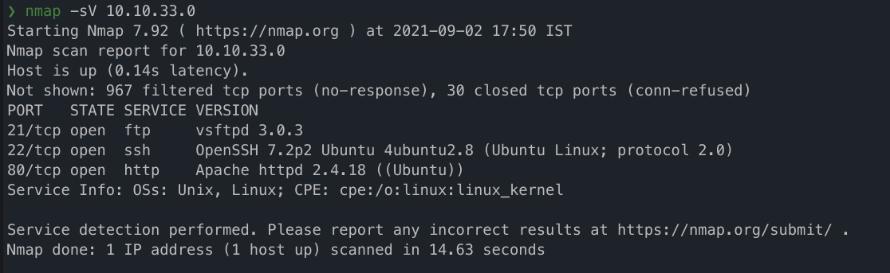
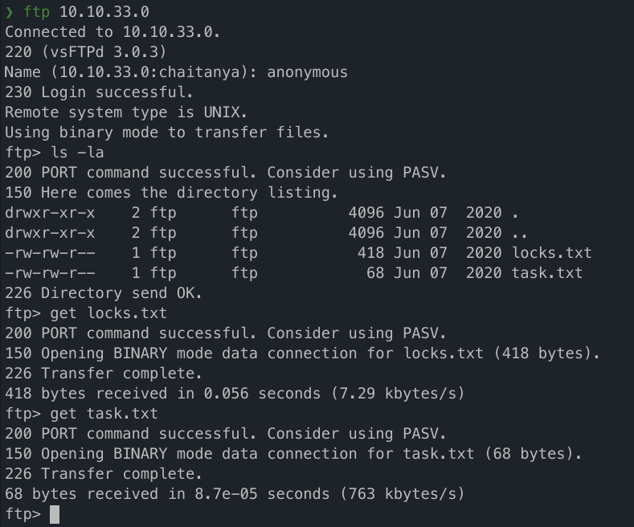
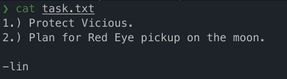
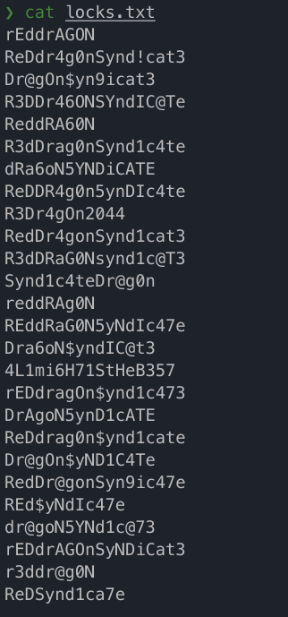
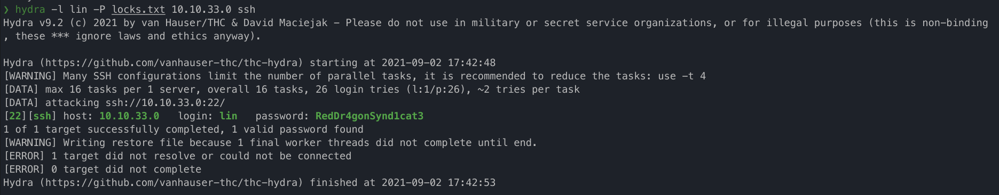
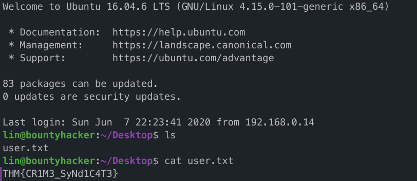
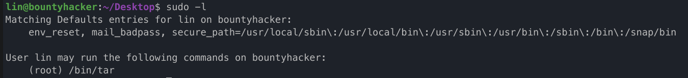
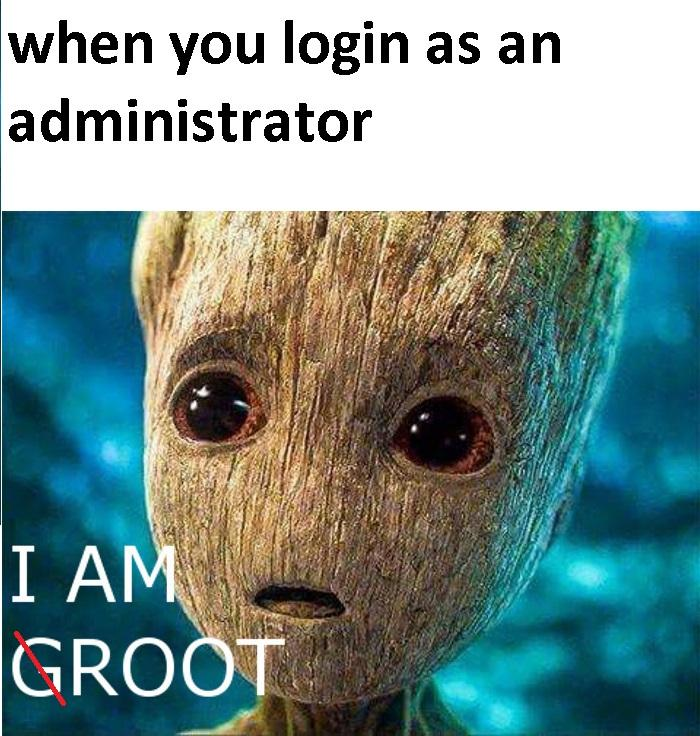
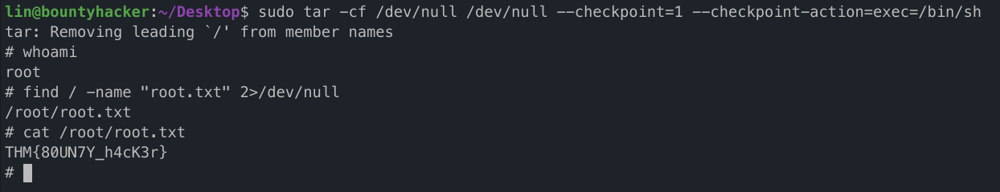

# TryHackMe | Bounty Hacker

[Bounty Hacker](https://tryhackme.com/room/cowboyhacker)

## Deploy the Machine

The instructions are pretty clear for this one. SMASH THAT GREEN BUTTON!!!

## Find open ports on the machine

We will use nmap to do a quick scan of the machine for open ports.



## Who wrote the task list?

To find out who wrote it, we first have to find the task list itself. Let's check the hint for this task, which is "Have you visited FTP?". First let's check if anonymous login is enabled for ftp. Yes it is. Great, now we can copy over the text files we find to our system using the get command.



Now let's see the contents of the task.txt.



We can see that the rather surreal sounding tasks have been written by "lin". This may potentially be a username that can be used later.

Let's look into locks.txt now. Looks like it is a list of passwords. It'll come in handy while brute-forcing the password.



## What service can you bruteforce with the text file found?

Now let's take a look at the hint for the next task. "What is on port 22?". SSH.

Let's brute force the ssh port using hydra. We use lin as the username and the retrieved locks.txt as our wordlist.

```bash
hydra -l lin -P locks.txt <IP> ssh

# -l -> username
# -P -> passwords (capital P specifies that we are providing a list)
```



Okay, we have the password now. Let's try to ssh into the machine using these credentials.


Lets look around the system for a bit. On checking the home directory, we find the user.txt. Well, that was easy.



Now to find root.txt, we have to escalate our privileges and gain root access to the system. To get started, we type sudo -l to see what commands our current user can run as root.



As we can see, lin can run /bin/tar as root. Lets head over to [https://gtfobins.github.io/](https://gtfobins.github.io/) and look for an exploit for this binary that can help us break out and gain a root shell. On searching for tar on the site, we get the following command.

```bash
sudo tar -cf /dev/null /dev/null --checkpoint=1 --checkpoint-action=exec=/bin/sh
```

Lets pop that into the shell and see what happens. Hmm, it seems we have successfully gained root access.



Now we use the find command to locate root.txt.



So there you have it. We have finally completed the room. This was an easy room, so beginners like me shouldn't have much problems with it. If you couldn't do it by yourself though, don't lose hope, the path is full of learning opportunities. Hope you learned something new today. Adios.
